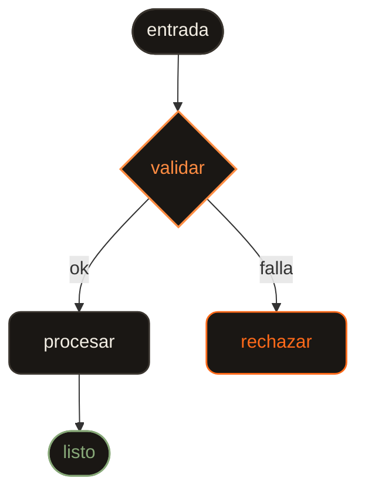
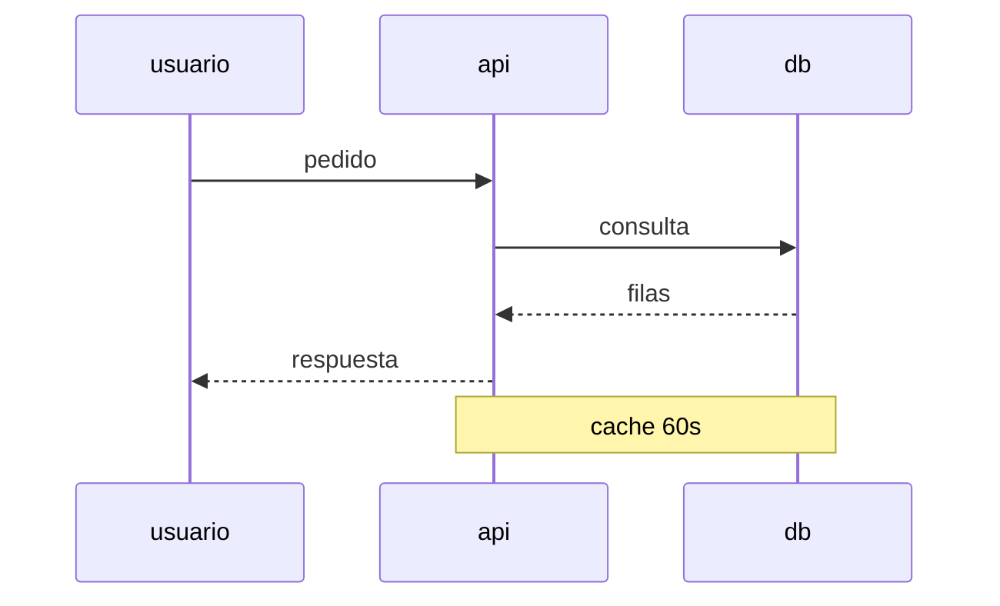
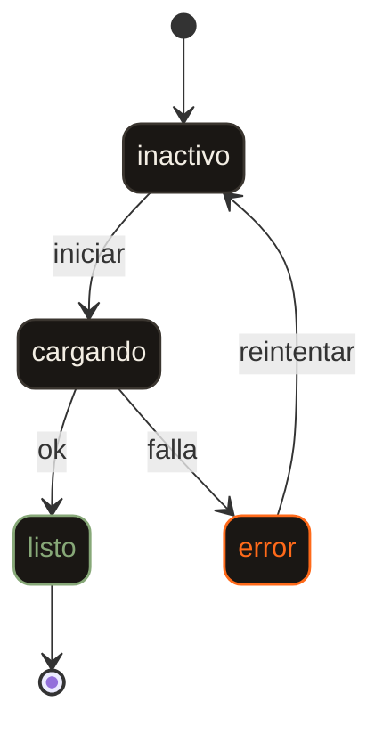
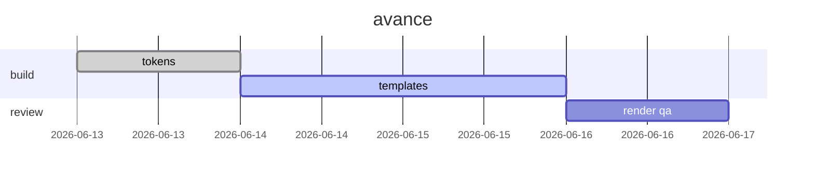
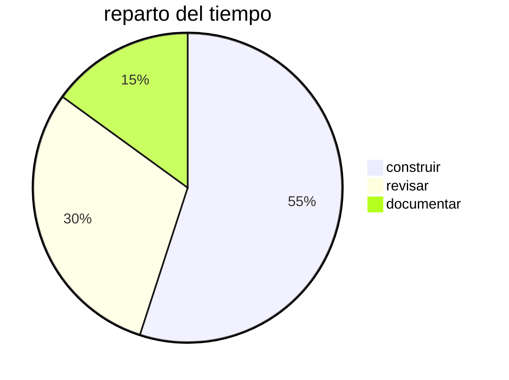

# mermaid — intensive, in-palette, dark

kodex uses heavy mermaid. Every diagram must look like it belongs in the dark
report: nodes styled like the report's cards, orange rationed, cream labels,
Nunito type. Two non-negotiable rules below — break either and the diagram
either fails to parse or renders ugly/light.

## RULE 1 — NEVER put `{{ }}` (or `{ }`) inside a mermaid block

Mermaid uses `{...}` for decision/rhombus nodes and `{{...}}` for hexagon
nodes, so a `{{PLACEHOLDER}}` token collides with node syntax → **"Syntax
error in text"**. The skill writes **literal, concrete labels** into mermaid at
generation time — never template braces. Use real lowercase Spanish words
(`entrada`, `validar`, `procesar`), exactly like a finished diagram.

- State diagrams: state ids cannot contain spaces or braces. Declare the label
  separately with the `s1 : etiqueta` form, then reference the id `s1`.
- If you truly need a hexagon, type the literal `{{...}}` with real words
  inside — but never a placeholder.

## RULE 2 — style nodes with a `classDef` component kit, NOT themeVariables

`themeVariables` node fills (`primaryColor`, `mainBkg`, `nodeBorder`…) render
light/lavender and unreliable across diagram types. Instead keep `%%{init}%%`
minimal (font, line color, edge-label background, edge-label text) and define a
**classDef kit** inside every diagram — classDef writes inline styles that
always win. Assign with `class nodeId hero`.

### The canonical block (reuse verbatim)

Minimal init (flowcharts / state):

```
%%{init: {'theme':'base','fontFamily':"'Nunito',sans-serif",'themeVariables':{'lineColor':'#cdbfa8','edgeLabelBackground':'#141210','tertiaryTextColor':'#F3EEE4'},'flowchart':{'curve':'basis','htmlLabels':true}}}%%
```

The component kit (paste at the END of the diagram body, then assign classes):

```
classDef step fill:#1a1714,stroke:#3a352f,stroke-width:0.09375rem,color:#F3EEE4,rx:0.625rem,ry:0.625rem;
classDef hero fill:#1a1714,stroke:#ff8c42,stroke-width:0.109375rem,color:#ff8c42,rx:0.625rem,ry:0.625rem;
classDef cool fill:#1a1714,stroke:#4FA6AB,stroke-width:0.09375rem,color:#4FA6AB,rx:0.625rem,ry:0.625rem;
classDef ok fill:#1a1714,stroke:#87A878,stroke-width:0.09375rem,color:#87A878,rx:0.625rem,ry:0.625rem;
classDef bad fill:#1a1714,stroke:#FF6A1A,stroke-width:0.09375rem,color:#FF6A1A,rx:0.625rem,ry:0.625rem;
```

Semantics: `step` = default card; `hero` = the rationed orange lead (≈one per
diagram — the decision point or happy path); `cool` = teal second voice; `ok` =
sage go/safe; `bad` = deep-orange failure. Edge labels render cream on the dark
`edgeLabelBackground` — keep them short.

## RULE 3 — the size contract (loader below enforces it; never hand-tune)

A diagram is the reason the report exists. It always renders **full width,
centred, on no background**, and at the **same minimum legible scale** no matter
how simple it is:

- **Vertical**: minimum `800px` (`50rem`), then grows to infinity. It **never**
  scrolls vertically.
- **Horizontal**: scrolls when it must — a thin orange hairline rule under the
  diagram, and invisible when it isn't needed.
- **Shapes never shrink.** The scale factor is `max(1, 800 / intrinsic_height)`:
  upscale-only, never below 1.

CSS cannot express this (an `<svg>` with a `viewBox` and `width:auto` stretch-fits
its container and scales the drawing *down* — that is exactly the bug this fixes).
So the loader reads each svg's `viewBox` and writes explicit px `width`/`height`.
Nothing in the CSS may mark `width`/`height` `!important`, or it would win over it.

## Load strategy (self-contained artifact)

Mermaid renders client-side. Paste this loader verbatim once before `</body>`:

```html
<script src="https://cdn.jsdelivr.net/npm/mermaid@11/dist/mermaid.min.js"></script>
<script>
  mermaid.initialize({ startOnLoad: false, securityLevel: 'loose' });
  mermaid.run().then(() => {
    const MIN_H = 800; // px — same minimum legible height for every diagram
    document.querySelectorAll('.diagram svg').forEach(svg => {
      const vb = svg.viewBox && svg.viewBox.baseVal;
      if (!vb || !vb.height) return;
      const k = Math.max(1, MIN_H / vb.height); // upscale-only: never shrink a shape
      svg.style.width = (vb.width * k) + 'px';  // overflow → .diagram scrolls sideways
      svg.style.height = (vb.height * k) + 'px'; // grows freely; never scrolls vertically
      svg.style.maxWidth = 'none';
    });
  });
</script>
```

Diagrams go in `<div class="diagram"><pre class="mermaid">…</pre></div>`.
Never give `.diagram` a background, a border or a frame — the diagram floats on
the page's near-black. **No white backgrounds anywhere inside the svg.**
Tradeoff: the CDN must be reachable at view time to render. For true offline
WhatsApp portability, pre-render the diagram to inline SVG (e.g. mermaid CLI)
and drop the `<svg>` straight into `.diagram` — then the loader isn't needed.

---

## Worked examples (all parse; all in-palette)

### 1 · flowchart (happy path = hero, failure = bad)



### 2 · sequenceDiagram

Style actors/notes via themeVariables here (sequence ignores classDef):



### 3 · stateDiagram-v2 (ids via `s1 : label`)



### 4 · gantt (status timeline)

Gantt colors come from themeVariables; sections alternate automatically:



### 5 · pie (share / breakdown)

Pie uses its own palette vars (no classDef):



---

## Tips for phone

- Prefer `TD` (vertical) over wide `LR` — fits a 390px column without scroll.
- Short labels, lowercase, one or two words.
- One `hero` (orange) per diagram; `cool`/`ok` for secondary branches; `bad`
  for the failure path. Don't paint everything orange.
- Wrap every diagram in `<div class="diagram">` so it gets the card frame and
  horizontal scroll fallback.
