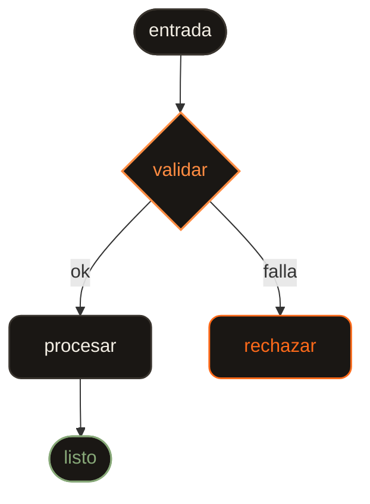

# fixture: KNOWN-GOOD — brace-free, themed, classDef component kit

```mermaid
%%{init: {'theme':'base','fontFamily':"'Nunito',sans-serif",'themeVariables':{'lineColor':'#cdbfa8','edgeLabelBackground':'#141210','tertiaryTextColor':'#F3EEE4'},'flowchart':{'curve':'basis','htmlLabels':true}}}%%
flowchart TD
  A([entrada]) --> B{validar}
  B -->|ok| C[procesar]
  B -->|falla| D[rechazar]
  C --> E([listo])
  classDef step fill:#1a1714,stroke:#3a352f,stroke-width:1.5px,color:#F3EEE4,rx:10,ry:10;
  classDef hero fill:#1a1714,stroke:#ff8c42,stroke-width:1.75px,color:#ff8c42,rx:10,ry:10;
  classDef ok fill:#1a1714,stroke:#87A878,stroke-width:1.5px,color:#87A878,rx:10,ry:10;
  classDef bad fill:#1a1714,stroke:#FF6A1A,stroke-width:1.5px,color:#FF6A1A,rx:10,ry:10;
  class A,C step
  class B hero
  class E ok
  class D bad
```
