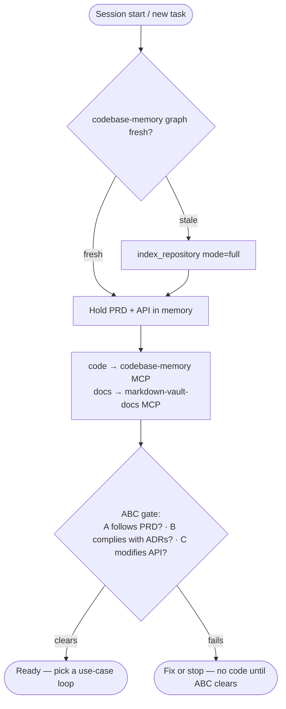
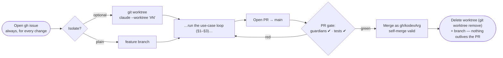
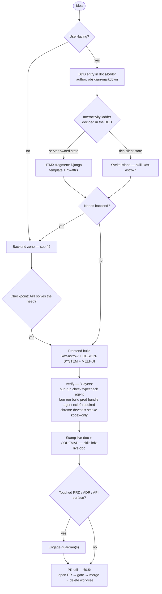
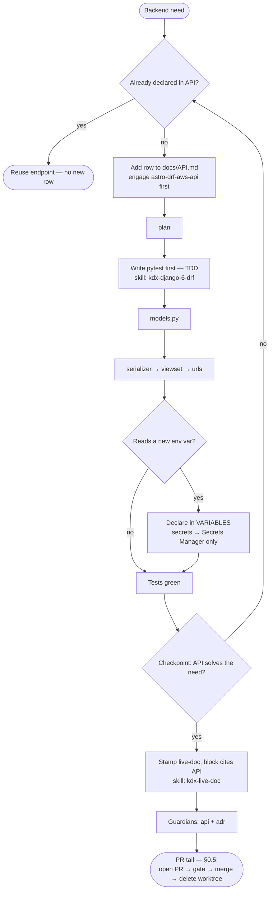
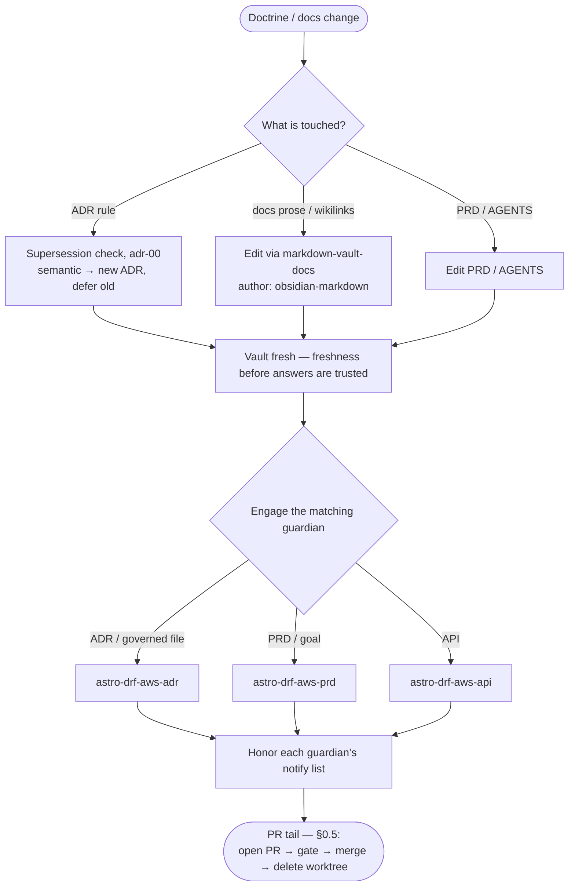

> [!important] This file owns the loop — definition and operational rendering
> The development loop is **defined here** and given force by [[adr-07-development-flow]]; [[PRD]] states the objective the loop serves, never the loop itself. This file carries both the canonical definition (below) and its operational rendering — the exact sequence and the tool or skill used at each step. Every other rule stays with its own SSOT: each node points at the file that owns it, and this runbook links rather than re-explaining ([[adr-00-adr-doctrine]] rule 1). Where a diagram could be read to disagree with a rule, the ADR-backed doc wins.

> [!warning] Read at code-start
> Open this before starting any code. It assumes [[PRD]] and [[API]] are already held in memory (the standing requirement in [[AGENTS]]) and that the ABC gate has cleared.

## The canonical workflows — the definition

A general definition, not a rigid script; [[adr-07-development-flow]] gives it force.

**The development loop:**

`idea → user-facing? → [[BDD]] → … → needs backend? → enter through [[API]]`

The backend zone is entered only through [[API]]:

1. Confirm the need cannot be met by the endpoints already declared in [[API]].
2. If it cannot: add the row to [[API]].
3. Enter the [[TDD]] flow — its normal cycle, driven by the harness skills.
4. **Checkpoint — does [[API]] solve the need?** Yes → return to the frontend track. No → loop back to 1.

The checkpoint is what defines the loop: the backend zone is exited only when [[API]] answers the feature's need.

**New backend piece:**

`plan → [[API]] → [[TDD]] → models.py → rest of DRF`

**New user-facing feature:**

`[[BDD]] → backend half → [[TDD]] → …`
`         → frontend half → tests per [[FRONTEND]] → implementation`

Both are active: every gate binds now, wherever its subject exists ([[adr-07-development-flow]] rule 6). The sections below render each one step by step.

## 0 · Boot — orientation before any code

Every use case shares this prefix. Code structure resolves through `codebase-memory-mcp`; `docs/` prose through the `markdown-vault-docs` MCP ([[adr-18-markdown-vault-mcp]]); [[PRD]] and [[API]] stay in memory; then the ABC gate ([[AGENTS]]).

## 0.5 · The change wrapper — issue in, PR out

Every use-case loop below is wrapped by the mandatory shape of [[adr-19-issue-worktree-pr]]: it opens with a `gh` issue and closes with a PR, never a direct commit to `main`. The worktree is optional; the issue and the PR are not.

The tail `Open PR → gate → merge → delete worktree` replaces the old "commit on main" step of every loop that follows; each §-loop renders only its own middle, entered after the issue and exited into the PR. SSOTs: [[adr-19-issue-worktree-pr]] · [[adr-08-github-and-git]] · [[GH]] · guardians [[adr-11-guardians]].

## 1 · Use case — a user-facing feature

The master loop, gated by [[adr-07-development-flow]]. Its ladder decision resolves through [[adr-04-frontend-and-design-system]] (criteria owned by [[HTMX]]); its backend excursion is §2.

> [!warning] `check` ≠ `build` ≠ `smoke` — three distinct verification layers
> Verify in order: `bun run check` (typecheck, agent) → `bun run build` (production bundle, agent, **headless, exit 0 required, before merge**) → browser smoke (`kodex`-only). The build gate is neither smoke nor `kodex`-only, and a green typecheck alone does not clear it. What each layer is and why they differ is owned by [[FRONTEND]] (*Testing → Verification layers*); this callout only names the ordering ([[adr-00-adr-doctrine]] rule 1).

SSOTs per step: [[BDD]] · [[FRONTEND]] · [[DESIGN-SYSTEM]] · [[MELT-UI]] · [[HTMX]] · [[API]] · verification in [[FRONTEND]]/[[BDD]] · [[adr-17-live-doc-backlinks]] · guardians [[adr-11-guardians]] · [[GH]].

## 2 · Use case — a new backend endpoint

The API-first sequence ([[adr-03-api-and-backend]]) and the checkpoint exit ([[adr-07-development-flow]]) as they are actually walked.

SSOTs per step: [[API]] · [[TDD]] · [[BACKEND]] · [[VARIABLES]] · [[CACHE]] (every response carries an explicit `Cache-Control`) · [[adr-17-live-doc-backlinks]] · guardians [[adr-11-guardians]].

## 3 · Use case — a docs / doctrine change

Here the docs *are* the product. An ADR rule change runs the supersession lifecycle ([[adr-00-adr-doctrine]]); prose is authored with `obsidian-markdown` and reached through the vault MCP; the matching guardian is engaged before the batch closes ([[adr-11-guardians]]).

SSOTs per step: [[adr-00-adr-doctrine]] · [[adr-18-markdown-vault-mcp]] · [[adr-11-guardians]] · [[GLOSSARY]] (a new name gets its row first) · [[GH]].

## Variants

- **Frontend-only** change → the `Needs backend? = no` branch of §1; [[API]] is never entered. The `bun run build` gate still runs headless before merge (see the §1 callout): this branch carries the fewest gates, so the bundle is where a broken import or SSR error surfaces.
- **Infra / AWS** change → the shape of §2 with the `kdx-aws-*` skills in place of [[API]]/[[TDD]]; the resource row lands in [[INVENTORY]] and carries the mandatory tag set ([[INFRASTRUCTURE]], [[adr-12-ephemeral-run]]).
- **Smoke tests** are `kodex`-only and interactive; an agent routine that reaches a smoke step stops and defers ([[AGENTS]]).