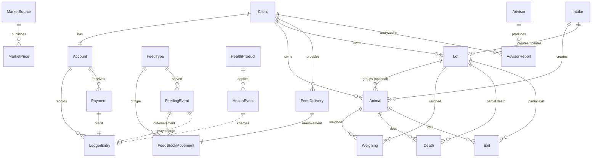

# FEEDLOT-DATA-MODEL — entities and relations

> [!note] Proposed
> SSOT for the feedlot entities. Force for the debated choices lives in
> [[adr-24-feedlot-domain]], [[adr-25-account-ledger]], [[adr-26-livestock-individual-and-lot]].
> Overview: [[FEEDLOT]]. Endpoints that expose these: `API-feedlot-additions.md` → [[API]].

Event-sourced: operational facts are immutable dated records; states and balances are
**derived**. Catalogs (`FeedType`, `HealthProduct`, `MarketSource`) are editable; every
other operational model is append-only, corrected by new events.

## Diagram

## Entities

Significant business fields only; `id`, audit timestamps and framework detail are
standard everywhere and omitted.

### `clients`

- **Client** — `name`, `kind` (`boarding` | `own`), `tax_id?`, `contact`, `is_active`.
- **Account** — `client` (1:1), `balance_cached` (denormalized ARS; derived from
  `LedgerEntry`, never the source of truth). Sign: positive = client owes.

### `livestock`

- **Animal** — `client`, `lot?`, `ear_tag` (unique among the client's active animals),
  `category` (`cow`|`bull`|`steer`|`heifer`|`calf`|…), `sex`, `status`
  (`active`|`dead`|`sold`|`exited`), `entry_date`, `entry_weight`,
  `current_weight` (derived from latest `Weighing`).
- **Lot** — `client`, `code`, `mode` (`anonymous` | `named`), `head_count`,
  `total_weight`, `status` (`active`|`closed`). Counters maintained by events.
- **Intake** — `client`, `date`, `mode` (`individual` | `lot`), `head_count?`,
  `total_weight?`; references created `Animal`s or `Lot`.
- **Weighing** — `animal?`, `lot?` (exactly one; see [[adr-26-livestock-individual-and-lot]]),
  `date`, `weight`.
- **Death** — `animal?`, `lot?`, `date`, `cause`, `head_count?`, `weight?`.
- **Exit** — `animal?`, `lot?`, `date`, `destination`, `head_count?`, `weight?`, `sale_price?`.

### `feed`

- **FeedType** — `name`, `unit` (default `kg`), `category`, `is_active`.
- **FeedDelivery** — `client`, `feed_type`, `quantity`, `date` → `in` movement to the
  client's stock.
- **FeedStockMovement** — `owner_kind` (`own` | `client`), `client?`, `feed_type`,
  `direction` (`in` | `out`), `quantity`, `date`, `source_kind`, `source_id`.
  Stock balance = Σin − Σout per (`owner_kind`, `client`, `feed_type`).
- **FeedingEvent** — `client`, `animal?`/`lot?`, `feed_type`, `quantity`, `unit_price`
  (historical ARS/kg), `origin` (`client_stock` | `own_stock`), `total_cost` (derived).
  Effects in [[adr-25-account-ledger]].

### `health`

- **HealthProduct** — `name`, `kind` (`vaccine` | `treatment`), `unit_price`, `is_active`.
- **HealthEvent** — `client`, `animal?`/`lot?`, `product`, `doses`, `unit_price`,
  `total_cost`. Posts a `debit`.

### `ledger`

- **LedgerEntry** — `account`, `date`, `direction` (`debit` | `credit`), `amount` (ARS),
  `concept` (`feeding`|`health`|`service`|`adjustment`|`payment`), `source_kind`,
  `source_id`, `unit_price?`, `quantity?`, `description`. Immutable.
- **Payment** — `account`, `date`, `amount`, `method`, `reference` → `credit` entry.

### `market`

- **MarketSource** — `name`, `slug`, `kind` (`market` | `index`), `is_active`.
- **MarketPrice** — `source`, `category`, `date`, `price_per_kg` (ARS/kg), `raw`.

### `advisors`

- **Advisor** — `slug` (`livestock` | `finance` | `admin`), `name`, `system_prompt`.
- **AdvisorReport** — `advisor`, `client`, `period_start`, `period_end`,
  `input_snapshot`, `output`, `model_id`, `tokens`, `latency`.

### `assets` (Phase 6 — abstract only)

No tables. Two abstract bases the crops/machinery models inherit ([[adr-32-multi-rubro-assets]] decision 1):

- **AssetBase** (abstract) — `name`, `code`, `status` (`active` | `retired`),
  `acquired_date?`, `notes`. Lifecycle base for a concrete asset.
- **CostedEvent** (abstract) — `client`, `date`, `unit_price`, `quantity`,
  `description`, `created_by` + `total_cost` property. Base for an event that
  snapshots price×quantity and (via its domain service) posts a `service` debit.

### `crops` (Phase 6)

- **Pivot** (`AssetBase`) — `client`, `area_ha`. A center-pivot circle (círculo). Editable catalog.
- **Crop** — `pivot`, `species` (`alfalfa` | `other`), `sown_date`, `status`
  (`active` | `terminated`), `notes`. Editable catalog.
- **Cutting** — `crop`, `date`, `kg_harvested`, `bales?`, `quality`, `notes`. A harvest
  event (corte). Immutable; posts **no** ledger entry ([[adr-32-multi-rubro-assets]] decision 4).
- **FieldTask** (`CostedEvent`) — `pivot`, `title`, `category`
  (`sowing`|`fertilizing`|`irrigation`|`weeding`|`other`). Labor (tarea); posts a
  `service` debit via `register_field_task` (`source_kind="field_task"`).

### `machinery` (Phase 6)

- **Machine** (`AssetBase`) — `client`, `category`
  (`tractor`|`harvester`|`mixer`|`truck`|`other`). A machine (maquinaria). Editable catalog.
- **MaintenanceEvent** (`CostedEvent`) — `machine`, `kind`
  (`preventive`|`corrective`|`other`), `title`, `hours?`. A service/repair
  (mantenimiento); posts a `service` debit via `register_maintenance`
  (`source_kind="maintenance_event"`).

## Generic costing (scalability)

`LedgerEntry` references its origin by `(source_kind, source_id)`, not by a per-domain
FK. This is the pivot that makes multi-domain costing additive ([[adr-24-feedlot-domain]]).
Phase 6 is the first proof: `crops` (`source_kind="field_task"`) and `machinery`
(`source_kind="maintenance_event"`) both post `service` debits through this same door,
and `ledger` gained no model, concept, or FK ([[adr-32-multi-rubro-assets]] decision 3).
Any next domain (e.g. equines) enters the same way.
