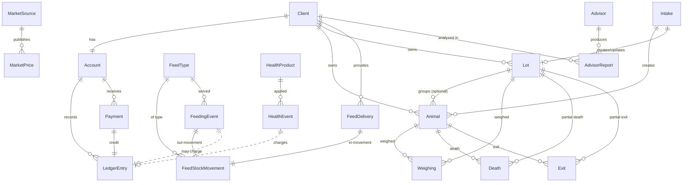

# FEEDLOT-DATA-MODEL — entities and relations

> [!note] Proposed
> SSOT for the feedlot entities. Force for the debated choices lives in
> [[adr-24-feedlot-domain]], [[adr-25-account-ledger]], [[adr-26-livestock-individual-and-lot]].
> Overview: [[FEEDLOT]]. Endpoints that expose these: `API-feedlot-additions.md` → [[API]].

Event-sourced: operational facts are immutable dated records; states and balances are
**derived**. Catalogs (`FeedType`, `HealthProduct`, `MarketSource`) are editable; every
other operational model is append-only, corrected by new events.

## Diagram

```mermaid
erDiagram
    Client ||--|| Account : has
    Client ||--o{ Animal : owns
    Client ||--o{ Lot : owns
    Client ||--o{ FeedDelivery : provides
    Account ||--o{ LedgerEntry : records
    Account ||--o{ Payment : receives
    Lot ||--o{ Animal : "groups (optional)"
    Animal ||--o{ Weighing : weighed
    Lot ||--o{ Weighing : weighed
    Animal ||--o{ Death : death
    Lot ||--o{ Death : "partial death"
    Animal ||--o{ Exit : exit
    Lot ||--o{ Exit : "partial exit"
    Intake ||--o{ Animal : creates
    Intake ||--o| Lot : "creates/updates"
    FeedType ||--o{ FeedStockMovement : "of type"
    FeedType ||--o{ FeedingEvent : served
    FeedDelivery ||--|| FeedStockMovement : "in-movement"
    FeedingEvent ||--|| FeedStockMovement : "out-movement"
    HealthProduct ||--o{ HealthEvent : applied
    FeedingEvent ||..o| LedgerEntry : "may charge"
    HealthEvent ||..o| LedgerEntry : charges
    Payment ||--|| LedgerEntry : "credit"
    MarketSource ||--o{ MarketPrice : publishes
    Advisor ||--o{ AdvisorReport : produces
    Client ||--o{ AdvisorReport : "analyzed in"
```

## Entities

Significant business fields only; `id`, audit timestamps and framework detail are
standard everywhere and omitted.

### `clients`

- **Client** — `name`, `kind` (`boarding` | `own`), `tax_id?`, `contact`, `is_active`.
- **Account** — `client` (1:1), `balance_cached` (denormalized ARS; derived from
  `LedgerEntry`, never the source of truth). Sign: positive = client owes.

### `livestock`

- **Animal** — `client`, `lot?`, `ear_tag` (unique among the client's active animals),
  `category` (`cow`|`bull`|`steer`|`heifer`|`calf`|…), `sex`, `status`
  (`active`|`dead`|`sold`|`exited`), `entry_date`, `entry_weight`,
  `current_weight` (derived from latest `Weighing`).
- **Lot** — `client`, `code`, `mode` (`anonymous` | `named`), `head_count`,
  `total_weight`, `status` (`active`|`closed`). Counters maintained by events.
- **Intake** — `client`, `date`, `mode` (`individual` | `lot`), `head_count?`,
  `total_weight?`; references created `Animal`s or `Lot`.
- **Weighing** — `animal?`, `lot?` (exactly one; see [[adr-26-livestock-individual-and-lot]]),
  `date`, `weight`.
- **Death** — `animal?`, `lot?`, `date`, `cause`, `head_count?`, `weight?`.
- **Exit** — `animal?`, `lot?`, `date`, `destination`, `head_count?`, `weight?`, `sale_price?`.

### `feed`

- **FeedType** — `name`, `unit` (default `kg`), `category`, `is_active`.
- **FeedDelivery** — `client`, `feed_type`, `quantity`, `date` → `in` movement to the
  client's stock.
- **FeedStockMovement** — `owner_kind` (`own` | `client`), `client?`, `feed_type`,
  `direction` (`in` | `out`), `quantity`, `date`, `source_kind`, `source_id`.
  Stock balance = Σin − Σout per (`owner_kind`, `client`, `feed_type`).
- **FeedingEvent** — `client`, `animal?`/`lot?`, `feed_type`, `quantity`, `unit_price`
  (historical ARS/kg), `origin` (`client_stock` | `own_stock`), `total_cost` (derived).
  Effects in [[adr-25-account-ledger]].

### `health`

- **HealthProduct** — `name`, `kind` (`vaccine` | `treatment`), `unit_price`, `is_active`.
- **HealthEvent** — `client`, `animal?`/`lot?`, `product`, `doses`, `unit_price`,
  `total_cost`. Posts a `debit`.

### `ledger`

- **LedgerEntry** — `account`, `date`, `direction` (`debit` | `credit`), `amount` (ARS),
  `concept` (`feeding`|`health`|`service`|`adjustment`|`payment`), `source_kind`,
  `source_id`, `unit_price?`, `quantity?`, `description`. Immutable.
- **Payment** — `account`, `date`, `amount`, `method`, `reference` → `credit` entry.

### `market`

- **MarketSource** — `name`, `slug`, `kind` (`market` | `index`), `is_active`.
- **MarketPrice** — `source`, `category`, `date`, `price_per_kg` (ARS/kg), `raw`.

### `advisors`

- **Advisor** — `slug` (`livestock` | `finance` | `admin`), `name`, `system_prompt`.
- **AdvisorReport** — `advisor`, `client`, `period_start`, `period_end`,
  `input_snapshot`, `output`, `model_id`, `tokens`, `latency`.

### `assets` (Phase 6 — abstract only)

No tables. Two abstract bases the crops/machinery models inherit ([[adr-32-multi-rubro-assets]] decision 1):

- **AssetBase** (abstract) — `name`, `code`, `status` (`active` | `retired`),
  `acquired_date?`, `notes`. Lifecycle base for a concrete asset.
- **CostedEvent** (abstract) — `client`, `date`, `unit_price`, `quantity`,
  `description`, `created_by` + `total_cost` property. Base for an event that
  snapshots price×quantity and (via its domain service) posts a `service` debit.

### `crops` (Phase 6)

- **Pivot** (`AssetBase`) — `client`, `area_ha`. A center-pivot circle (círculo). Editable catalog.
- **Crop** — `pivot`, `species` (`alfalfa` | `other`), `sown_date`, `status`
  (`active` | `terminated`), `notes`. Editable catalog.
- **Cutting** — `crop`, `date`, `kg_harvested`, `bales?`, `quality`, `notes`. A harvest
  event (corte). Immutable; posts **no** ledger entry ([[adr-32-multi-rubro-assets]] decision 4).
- **FieldTask** (`CostedEvent`) — `pivot`, `title`, `category`
  (`sowing`|`fertilizing`|`irrigation`|`weeding`|`other`). Labor (tarea); posts a
  `service` debit via `register_field_task` (`source_kind="field_task"`).

### `machinery` (Phase 6)

- **Machine** (`AssetBase`) — `client`, `category`
  (`tractor`|`harvester`|`mixer`|`truck`|`other`). A machine (maquinaria). Editable catalog.
- **MaintenanceEvent** (`CostedEvent`) — `machine`, `kind`
  (`preventive`|`corrective`|`other`), `title`, `hours?`. A service/repair
  (mantenimiento); posts a `service` debit via `register_maintenance`
  (`source_kind="maintenance_event"`).

### `feedyard` (Phase 7 — pen operating loop)

The daily corral loop ([[adr-33-feedyard-operating-loop]]). Catalogs are editable;
`LoadingOrder`/`BunkScore` are immutable events. **Nothing here posts a ledger
entry** (decision 1) — billing stays in `feed`.

- **Pen** — `code`, `name`, `capacity_head?`, `status` (`active` | `inactive`),
  `notes`. A physical corral. Editable catalog.
- **Ration** — `name`, `description`, `is_active`. A named diet/recipe. Editable.
- **RationLine** — `ration`, `feed_type`, `proportion` (percent, as-fed),
  `dry_matter_pct`. One share of a `Ration`; edited nested under it.
- **LoadingOrder** — `pen`, `ration`, `date`, `planned_as_fed_kg`, `notes`,
  `created_by`. The **planned** mixer load (orden de carga); immutable; posts no
  ledger entry. Distinct from the executed `FeedingEvent` (decision 2).
- **BunkScore** — `pen`, `date`, `score` (`0`–`4`), `notes`, `created_by`. A daily
  bunk (feed-trough) reading; immutable; posts no ledger entry.

`feed.FeedingEvent` gains an optional `pen` FK (nullable, additive — decision 3): the
executed ration that actually charges (adr-25 rule 4) can now be grouped by corral,
which is what the Phase 7 cost-side pen summary in `apps.metrics` reads (decision 7).

### `feedyard` (Phase 7b — pen placement)

Where the cattle are ([[adr-34-pen-placement]]). Immutable event; posts **no** ledger
entry. Occupancy is derived, never stored.

- **PenPlacement** — `pen`, `animal?`/`lot?` (exactly one; XOR CHECK, same shape as
  adr-26), `date`, `direction` (`in` | `out`), `head_count?` (head for a partial lot
  move; `1`/`null` for an individual), `notes`, `created_by`. Moves hacienda into or
  out of a pen; `register_placement` rejects an inactive pen or a non-active animal
  (decision 4). Pen occupancy = Σ head(`in`) − Σ head(`out`), derived (decision 1).

## assistant (Phase 8 — conversational assistant)

The generating tier of adr-15, bounded ([[adr-35-conversational-assistant]]). Read-only
forever; posts **no** ledger entry and never acts. Multi-turn counterpart of the advisors.

- **Conversation** — `client` (PROTECT), `title`, `created_by`, `created_at`. A per-client
  Q&A thread; the scope is a hard boundary (decision 2).
- **Message** — `conversation` (CASCADE), `role` (`user` | `assistant`), `text`, and — for
  `assistant` turns — the inference audit `input_snapshot`, `model_id`, `tokens`,
  `latency_ms` (decision 4). Immutable once written; a turn is corrected by another turn
  (decision 6). The snapshot reuses the advisors' `build_snapshot`, so the assistant and the
  dashboard read the same numbers (decision 3).

## notifications (Phase 9 — outbound digest)

The outbound layer ([[adr-36-notifications-digest]]). Read-only over domain data; posts
**no** ledger entry and never acts. Renders a per-client weekly digest from
`apps.metrics.summary` (one definition of each number, decision 1) and delivers it through a
channel abstraction gated by DEBUG (`MockSender` in DEBUG/tests, `WhatsAppSender` in deploy,
decision 2).

- **Notification** — `client` (PROTECT), `channel` (`whatsapp` | `email`), `to_address`,
  `subject`, `body`, `status` (`pending` | `sent` | `failed`), `error`,
  `provider_message_id`, `created_by`, `created_at`, `sent_at`. An immutable record of one
  send attempt; a retry is a new record, never an edit (decision 3). Written only by
  `send_notification`, the sole sanctioned write path.

## inventory (Phase 10 — general input stock)

Generalises the feed-stock pattern to non-feed inputs ([[adr-37-inventory-and-weather]]).
Stock is derived Σin − Σout, never stored; posts **no** ledger entry (decision 3).

- **InputType** — `name` (unique), `unit`, `category`, `is_active`. Editable catalog of a
  general input (diesel, posts, wire, sanitary); full CRUD (decision 2).
- **InputStockMovement** — `owner_kind` (`own` | `client`), `client` (nullable, PROTECT),
  `input_type` (PROTECT), `direction` (`in` | `out`), `quantity`, `unit_price` (nullable,
  **informational** — no charge), `date`, `note`, `(source_kind, source_id)` generic seam,
  `created_by`, `created_at`. Immutable in/out event; `list`/`retrieve`/`create` (decision 2).
  Written only by `register_input_movement`, which gates an inactive type and a non-positive
  quantity (decision 4). A negative-driving out is accepted, surfaced later, not blocked.

## weather (Phase 10 — rainfall/weather log)

An immutable per-date environmental record ([[adr-37-inventory-and-weather]] decision 5),
independent of the ledger and the domain.

- **WeatherLog** — `site`, `date`, `rainfall_mm`, `temp_min` (nullable), `temp_max`
  (nullable), `note`, `created_by`, `created_at`. Immutable; `list`/`retrieve`/`create`.
  Written only by `register_weather_log`, which enforces non-negative rainfall and a
  coherent temperature range. `apps.metrics.rainfall_summary` aggregates a period.

## traceability (Phase 11 — SENASA: RENSPA, DT-e, caravana)

SENASA traceability as a new app on the spine ([[adr-38-senasa-traceability]]), touching
neither `livestock` nor the ledger. The RENSPA is an editable catalog; the DT-e and the
caravana are immutable events.

- **Establishment** — `renspa` (unique), `name`, `holder`, `location`, `is_active`.
  Editable catalog; full CRUD (decision 1).
- **TransitDocument** (DT-e) — `dte_number` (unique), `origin`/`destination` (FK
  `Establishment`, PROTECT), `date`, `category`, `head_count`, `total_weight` (nullable),
  `lot` (nullable FK `livestock.Lot`), `note`, `created_by`, `created_at`. Immutable;
  `list`/`retrieve`/`create`. Written only by `register_transit`, which rejects an
  inactive origin/destination, a self-transit, a non-positive head count and a duplicate
  `dte_number` (decision 3). Posts **no** ledger entry (decision 2).
- **Caravana** — `official_number` (unique), `animal` (FK `livestock.Animal`, PROTECT),
  `assigned_date`, `note`, `created_by`, `created_at`. Immutable; `list`/`retrieve`/`create`.
  Written only by `register_caravana`, which rejects a non-active animal and a duplicate
  official number (decision 4). `apps.metrics.caravana_coverage` derives the share of a
  client's active head that carry a caravana, `null` when there is no active head (decision 5).

## fx (Phase 12 — reference exchange rates)

Reference FX as a new app mirroring `market`: an external value series, **never** the
ledger's currency ([[adr-39-gross-margin-and-fx]]). The account stays in ARS with the
historical price per movement ([[adr-25-account-ledger]] rule 3); an FX rate only lets a
derived metric be *expressed* in another currency, and posts no ledger entry.

- **FxRate** — `currency` (e.g. `"USD"`), `date`, `rate` (ARS per one unit of `currency`,
  `max_digits=18`, `decimal_places=6`), `source` (default `"manual"`), `created_at`,
  `updated_at`. Idempotent by `(currency, date, source)` — reingesting a day updates the
  row, never duplicates it (decision 2). Editable via `list`/`retrieve`/`create`; written
  through `register_fx_rate`, which rejects a non-positive rate.
  - `latest_rate(currency, on_or_before=None, source=None)` — most recent row on or before
    a date, or `None`.
  - `convert_ars(amount_ars, currency, on_or_before=None, source=None)` — `amount_ars ÷ rate`
    with the row used, or `(None, None)` when there is no rate.

## gross_margin (Phase 12 — derived reference margin)

A pure function in `apps.metrics` (no model — one definition, [[adr-29-metrics-derivation]]
rule 1): `income − cost` for one client and period, where income is a **reference** value
(`kilos_gained × latest market price` for the category) and cost is `cost_breakdown` total
(debits only). Income posts no ledger entry (decision 5). Returns `null` + a
`not_calculable` reason for each missing input — `no_measured_growth`, `no_weight_gain`,
`no_reference_price` — never a filled zero (decision 4). When `currency` is given, the ARS
margin always comes back and only `margin_currency` is `null` (`no_fx_rate`) if there is no
`FxRate`. Exposed read-only at `GET /api/clients/{id}/metrics/gross-margin/`.

## expenses (Phase 4d — extra charges billed to a client)

- **ExpenseEvent** — a `CostedEvent` (abstract base reused from `assets`,
  [[adr-32-multi-rubro-assets]]): `client` (PROTECT), `lot?` (attributes the charge to
  one lot; null = the whole client), `date`, `category` (`labor`|`fuel`|`machinery`|
  `other`), `unit_price`, `quantity`, `description`. On create it posts a `service`
  `debit` `LedgerEntry` through the generic `(source_kind="expense_event", source_id)`
  seam ([[adr-24-feedlot-domain]] rule 4) — no new ledger model, `Concept`, or migration
  ([[adr-25-account-ledger]] rule 1). It snapshots `unit_price`×`quantity` at posting
  time, so a later price change never rewrites the charge (rule 3). Immutable:
  `list`/`retrieve`/`create` only. This is the in-doctrine rendering of the field
  manager's "carga de deudas" — an event that posts to the ledger, never a manual debit
  ([[adr-44-field-operational-roles]] decision 6).

## breeding (Cría phase — reproduction events)

The reproductive cycle `servicio → tacto → parición → destete` as a new app on the spine
([[adr-46-breeding-reproduction]]), touching neither `livestock` nor the ledger except the
one AI-service charge. The four events reuse the `LifecycleEvent` XOR base (adr-28 d1); the
IATF protocol is an editable template like `SanitaryPlan` (adr-40). Reproductive status is
**derived** from the events, never stored (decision 3).

- **Service** — `animal?`/`lot?` (exactly one; XOR CHECK, `LifecycleEvent` base), `date`,
  `method` (`natural`|`ai`|`iatf`|`embryo_transfer`), `sire` (nullable FK `genetics.Sire`),
  `semen_batch` (nullable FK `genetics.SemenBatch`, for `ai`/`iatf`), `embryo_batch`
  (nullable FK `genetics.EmbryoBatch`, for `embryo_transfer`), `protocol` (nullable FK
  `IatfProtocol`, for `iatf`), `service_price` (nullable — the insemination fee),
  `note`, `created_by`. Immutable; `list`/`retrieve`/`create`. Written only by
  `register_service`, which decrements a `SemenMovement`/`EmbryoMovement` `out` and, for
  `method ∈ {ai, iatf}` on a `Client(kind=boarding)` target, posts a `service` `debit`
  via `(source_kind="breeding_service", source_id)` snapshotting `service_price`
  (decision 6). Natural/own services and every other event post **no** ledger entry.
- **PregnancyCheck** — `animal?`/`lot?` (XOR), `date`, `method`
  (`palpation`|`ultrasound`|`blood`), `result` (`pregnant`|`empty`|`uncertain`),
  `gestation_days` (nullable), `service` (nullable FK `Service` — which service it
  confirms, hence the sire), `note`, `created_by`. Immutable; posts no ledger entry. The
  estimated calving date is **derived** (`date + (280 − gestation_days)`), never stored.
- **Calving** — `animal?`/`lot?` (XOR), `date`, `outcome` (`live`|`stillborn`|`aborted`),
  `calving_ease` (`normal`|`assisted`|`caesarean`), `calf_sex` (nullable), `calf_weight`
  (nullable birth weight), `births_count?` (for a lot calving), `service` (nullable FK),
  `calf` (nullable FK `livestock.Animal` — the calf a live individual calving creates),
  `note`, `created_by`. Immutable; posts no ledger entry. Genealogy is **derived**
  (`dam = target`, `sire = service.sire`), never a field on `Animal` (decision 4).
- **Weaning** — `animal?`/`lot?` (XOR), `date`, `weaning_weight`, `purpose`
  (`replacement`|`sale`|`undecided`), `note`, `created_by`. Immutable; posts no ledger
  entry. The recría hand-off; the weaned head continues as a normal `Animal` (decision 9).
- **IatfProtocol** — `name`, `description`, `is_active`. Editable template; full CRUD.
- **IatfProtocolStep** — `protocol`, `day_offset`, `action`, `product` (free text or
  `HealthProduct` ref), `note`. One step at a relative offset; edited nested under the
  protocol. Absolute dates are **derived** from the referencing `Service.date` (decision 5).

Reproductive metrics live in `apps.metrics` as pure functions (decision 8): `pregnancy_rate`,
`calving_rate`, `weaning_rate`, `calving_interval` (IEP), `kg_weaned_per_dam` — each
`null` + a `not_calculable` reason when the input is missing ([[adr-29-metrics-derivation]]).

## genetics (Cría phase — semen, DEP, embryo transfer)

The genetic catalog and the semen/embryo inventory-by-movements
([[adr-47-genetics-semen-embryo]]). Catalogs are editable; movements, flushes and sales are
immutable. Stock is **derived** Σin − Σout, never stored (decision 2). Only the semen sale
posts a ledger entry — a `sale` credit to the own account (decision 4).

- **Sire** — `name`, `breed`, `animal` (nullable FK `livestock.Animal` — an own bull, else
  external), `registry_id` (nullable), `is_active`, `note`. Editable catalog; full CRUD.
- **BreedingValue** — `sire`, `trait`
  (`birth_weight`|`weaning_weight`|`milk`|`ribeye_area`|`marbling`|`scrotal`|`other`),
  `value`, `accuracy` (nullable), `source`, `date`. A DEP/EPD row; editable catalog
  (decision 3) — loaded, not derived from the system's own weighings.
- **SemenBatch** — `sire`, `batch_code`, `collection_date` (nullable), `supplier`,
  `tank` (nullable — termo), `position` (nullable — canister/rack), `unit_cost` (nullable,
  **informational**), `expiry_date` (nullable), `is_active`, `note`. Editable catalog.
  Straws remaining = Σin − Σout of its movements, never stored.
- **SemenMovement** — `semen_batch` (PROTECT), `direction` (`in`|`out`), `straws`
  (quantity), `reason` (`purchase`|`collection`|`insemination`|`sale`|`discard`|`adjustment`),
  `date`, `(source_kind, source_id)` generic seam (→ `Service` or `SemenSale`), `note`,
  `created_by`. Immutable; written only by `register_semen_movement`, which gates an
  inactive batch and a non-positive quantity (decision 7). Posts **no** ledger entry.
- **SemenSale** — `semen_batch` (PROTECT), `date`, `straws`, `unit_price` (ARS/straw),
  `buyer_name`, `buyer_client` (nullable FK `clients.Client` — informational),
  `note`, `created_by`. Immutable; written only by `register_semen_sale`, which rejects
  insufficient stock and a non-positive price, then in one transaction posts a `sale`
  `credit` to the **own** account via `(source_kind="semen_sale", source_id)` snapshotting
  `unit_price`×`straws` (decision 4) and a `SemenMovement` `out` (`reason=sale`).
- **EmbryoBatch** — `donor` (FK `livestock.Animal`), `sire` (nullable FK `Sire`), `grade`,
  `flush_date` (nullable), `tank` (nullable), `position` (nullable), `is_active`, `note`.
  Editable catalog. Embryos remaining = Σin − Σout of its movements, never stored.
- **EmbryoMovement** — `embryo_batch` (PROTECT), `direction` (`in`|`out`), `quantity`,
  `reason` (`collection`|`transfer`|`sale`|`discard`|`adjustment`), `date`,
  `(source_kind, source_id)` seam, `note`, `created_by`. Immutable; posts no ledger entry.
- **EmbryoFlush** — `donor` (FK `livestock.Animal`), `sire` (nullable FK `Sire`), `date`,
  `embryos_collected`, `grade`, `note`, `created_by`. Immutable donor-collection event
  (colecta); written by `register_embryo_flush`, which creates/updates an `EmbryoBatch` and
  posts an `EmbryoMovement` `in`. Posts **no** ledger entry (decision 6).

Genetics metrics in `apps.metrics` (decision 8): semen stock per batch and per sire, total
available straws, and per-sire usage — `null` + reason when there are no movements.

## Generic costing (scalability)

`LedgerEntry` references its origin by `(source_kind, source_id)`, not by a per-domain
FK. This is the pivot that makes multi-domain costing additive ([[adr-24-feedlot-domain]]).
Phase 6 is the first proof: `crops` (`source_kind="field_task"`) and `machinery`
(`source_kind="maintenance_event"`) both post `service` debits through this same door,
and `ledger` gained no model, concept, or FK ([[adr-32-multi-rubro-assets]] decision 3).
Phase 4d adds `expenses` (`source_kind="expense_event"`) through the identical door.
The Cría phase adds two more through the same seam with **no** new `ledger` model:
`breeding` (`source_kind="breeding_service"`, a `service` debit to a boarding client for
an AI/IATF service) and `genetics` (`source_kind="semen_sale"`, a `sale` **credit** to the
own account for a semen sale — the first credit through the seam, reusing `Concept.SALE`
from [[adr-43-sale-settlement]]). Any next domain (e.g. equines) enters the same way.
