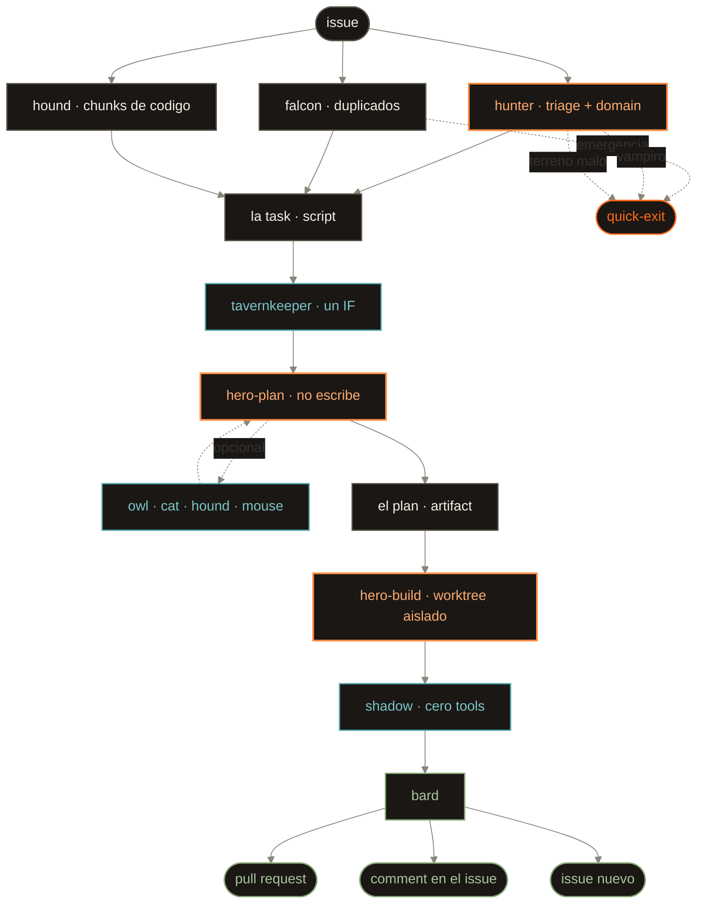
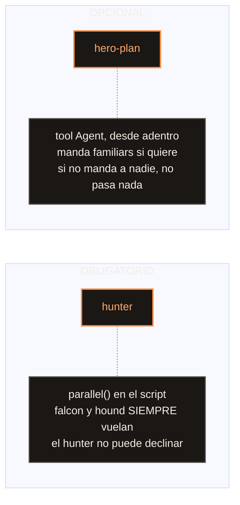

# TRIAGE-TEAMMATES — the party that hunts an issue

The `triage-and-fix` Workflow takes **one issue** and ends with a pull request, a comment on
that issue, or a new issue. Between those two points nothing is improvised: a JavaScript
script holds the plan, and every node is an agent whose **tool grant is its contract**.

Vendored per [[adr-14-harness]] and inventoried in [[HARNESS]]. The skill that documents and
validates it is `.claude/skills/kdx-wf-triage-and-fix/`; the script the runtime actually runs
is `.claude/workflows/triage-and-fix.js`; the cast lives in `agents/wf-*.md`.

> [!important] The one idea to keep
> **Reliability here has exactly three sources: model tier, tool grant, and the schema that
> closes the output.** It is never a property of a name. The owl is not reliable because it
> is an owl — it is reliable because a closed question against an allowlisted first-party
> domain is a reliable *shape*. An earlier draft of this system wrote "the owl is the only
> trustworthy familiar" and a model read that as an engineering fact. That is the failure
> this design exists to prevent.

## The party

Ten members. **Two of them are not agents at all** — the task and the tavernkeeper are script,
and that is the point of them.

| # | Who | agentType | Model | Tools — *this is the enforcement* |
|---|---|---|---|---|
| 1 | 🎯 **hunter** | `wf-hunter` | sonnet | Bash, Read, Glob, Grep |
| 2 | 🦅 **falcon** | `wf-falcon` | haiku | Bash |
| 3 | 🐕 **hound** | `wf-hound` | haiku | Read, Glob, Grep |
| — | 📋 **the task** | *script* | — | — |
| — | 🍺 **tavernkeeper** | *script `if`* | — | — |
| 4 | ⚔️ **hero**, planning | `wf-hero-plan` | opus | Read, Glob, Grep, Agent — **no write, no web** |
| 4a | 🦉 **owl** | `wf-owl` | haiku | WebSearch, WebFetch |
| 4b | 🐈‍⬛ **cat** | `wf-cat` | haiku | WebSearch, WebFetch |
| 4c | 🐕 **hound** | `wf-hound` | haiku | Read, Glob, Grep |
| 4d | 🐁 **mouse** | `wf-mouse` | haiku | Read, Glob, Grep |
| 5 | ⚔️ **hero**, building | `wf-hero-build` | opus | Read, Glob, Grep, Edit, Write, Bash — **no web, no Agent** |
| 6 | 👤 **shadow** | `wf-shadow` | sonnet | **none at all** |
| 7 | 🎻 **bard** | `wf-bard` | sonnet | Bash |

Seven `agent()` calls per issue. Two of them opus.

## The flow



## The two fan-outs, and why they differ

This is the load-bearing asymmetry, and it is not an inconsistency:



The **hunter's** scouts live in the script's `parallel()`. It cannot decline to be scouted
for, because it is not the one who calls them.

The **hero's** familiars are spawned by the hero itself, with its own `Agent` tool. On an
`easy` × `small` job — a fix it can already see in the chunks the hound brought — it sends
nobody and nothing fails. The rule of thumb it carries: *send a familiar when you would
otherwise be guessing.*

These are the only two places the runtime offers, and the difference between them **is** the
mandatory/optional distinction.

## The tavernkeeper is an `if`

> [!warning] It used to be an agent. It was deleted, not moved.
> Two sonnet calls whose entire output was a label interpolated into a prompt. It routed to
> no different agent — the hero is one opus agent either way — granted no different tools,
> and chose no different model. **It was not a router; it was a second, worse read of an
> issue the hunter had already read with tools in hand.**

The judgment moved to the node already paying for that context (`hunterSchema.domain`), and
what remains is what it always was:

```js
const domain = paperwork.domain;
const domainBrief = DOMAIN[domain] || 'No domain brief. Work from the task alone.';
```

The character stays — an `if` is allowed a voice. The lesson generalises: **a node that
re-derives, at lower context, a judgment an upstream node was already holding is not a gate.
It is a worse copy.**

## The prey table

The hunter tags every issue on two axes. Rows are `difficulty`, columns are `size`.

|  | **small** | **medium** | **large** |
|---|---|---|---|
| **easy** | hierbas | ratas gigantes | goblins |
| **medium** | puma | huargos | orcos |
| **hard** | jabalies | skaven asesino | waaaagh! |

Off the grid: **vampiro** — impossible not because it is big but because it **does not stay
dead**. A recurring defect. It routes straight to quick-exit.

The axes are orthogonal on purpose. A one-line fix repeated across forty files is
`easy` × `large`. A single hidden race is `hard` × `small`.

> [!note] The tags choose the posture, never the model
> The hero is opus regardless. What `difficulty` × `size` buys is **how much fan-out is worth
> it**: `hard`/`large` → send familiars before committing to an approach; otherwise → you
> likely need nobody.

## The flavour is a render, never an input

Every schema carries typed fields and the two machine tags — **never a prey name, never a
scene**. No node reads "skaven" out of another node's output. The prey name is derived from
the tags *after* every decision is made, and it only reaches the log.

The party's spoken lines are the same: a closed `SAY` table in the script, written in advance.
**No node produces its own line**, and there is no `quote` field in any schema — a
model-generated line would be model output reaching the log, which is a channel: inert today,
load-bearing the first time someone parses it.

Strip every animal from this system and every outcome is byte-identical.

## Two nodes worth understanding

### 👤 shadow — blind on purpose

Zero tools. Not "no docs", not "no web": **it cannot open a single file**. Verified
empirically — a probe agent declared `tools: []` reports `NO TOOLS AVAILABLE` and makes zero
tool calls.

It answers one question: *does this code stand up with nothing else in hand?* That is a
different gate than a guardian's ([[adr-11-guardians]]): a guardian checks code **against**
the constitution; the shadow checks whether it is self-sufficient **without** it. Code that
only makes sense with [[PRD]] open beside it fails here regardless of any guardian verdict.

Its blindness is why `hero-build`'s `diff` field is load-bearing: that string is the **only**
way the code is ever seen by anyone downstream.

### 🎻 bard — the terminal verdict

The only node that mutates anything outside the working tree. It weighs two witnesses who saw
different things:

- The hero's account of what it **ran** is first-hand evidence.
- The hero's account of whether the code is **clear** is worthless — the author is the one
  person who cannot un-know the intent.
- The shadow is the better witness on legibility, and guessing on anything else.

**Not hunted is not failure.** The default for a failed hunt is a **comment on the issue the
run started from** — a new issue saying "we tried #42 and failed" orphans the finding from
#42. A new issue is only for a genuinely different subject.

## Running it

```
Workflow({ name: 'triage-and-fix',
           args: { issue: '42', repo: 'kodexArg/astro-drf-aws' } })
```

Several issues, sequentially — the list is **yours**, not the workflow's. The script has no
shell and cannot run `gh issue list` itself, and it should not: a party that picks its own
work is a party with no owner.

```
Workflow({ name: 'triage-and-fix',
           args: { issues: ['41','42','43'], repo: 'kodexArg/astro-drf-aws' } })
```

Sequential is deliberate: `pipeline()` would run N heroes at once, and an abort mid-flight
would leave N half-hunts.

> [!warning] Prerequisites, both real
> Dynamic workflows must be **on** (`/config`), and the session must have **started after**
> the `wf-*` cast landed — the agent registry loads at startup.

## What it does NOT do — read this before trusting a run

This workflow is generic. **This repo's mandatory gates are not in it**, and no node enforces
them:

- **No [[BDD]] or [[TDD]] entry is written.** [[adr-07-development-flow]] rule 1 requires the
  BDD entry to exist before the code does; [[adr-03-api-and-backend]] rule 2 requires
  `plan → API → TDD → models.py`. No schema field carries either.
- **No guardian is engaged.** [[adr-11-guardians]] rule 3 — *guardians are sought, not only
  triggered*. Seven `agent()` calls and none is a guardian.
- **No [[API]] row check.** A new endpoint's row must land before its code
  ([[adr-03-api-and-backend]] rule 1).
- **No live-doc block or CODEMAP stamping** ([[adr-17-live-doc-backlinks]]).
- **The hunter's constitution check is narrower than the ABC gate** in [[AGENTS]]: it is
  permissive-by-default (`false` only when a written rule *forbids* the issue) and never asks
  whether the change touches [[API]].

The bard opens a PR; it never merges. That leaves [[adr-19-issue-worktree-pr]] rule 4's gate
room to run — but **nothing inside this workflow populates it**. Treat a `triage-and-fix` PR
as a draft that still owes its gates.

> [!success] What it does get right
> It never reaches for a browser smoke test — the shadow reviews a diff string with zero
> tools, the bard never opens chromium. And `wf-hero-build` runs with `isolation: 'worktree'`,
> so it never writes into the checkout the run was launched from.
