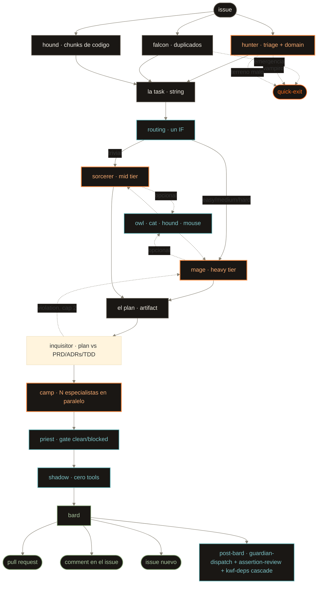
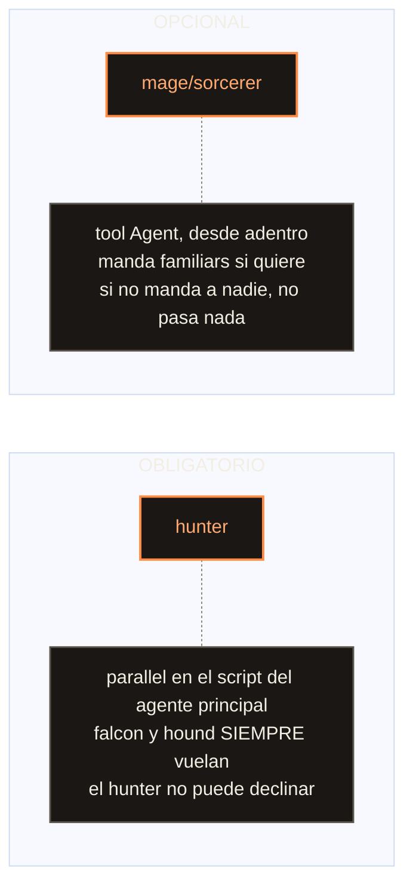

# TRIAGE-TEAMMATES — the party that hunts an issue

The `triage-and-fix` skill takes **one issue** and ends with a pull request, a comment on
that issue, or a new issue. Between those two points nothing is improvised: the skill's
`SKILL.md` holds the playbook, and every node is an agent whose **tool grant is its
contract**.

Vendored per [[adr-02-harness]] and inventoried in [[SKILL-INVENTORY]]. The skill that
documents and drives it is `docs/skills/triage-and-fix/` (mirrored at
`.claude/skills/triage-and-fix/` and `skills/triage-and-fix/`); the cast — 18 nodes —
lives in `docs/agents/kwf-*.md`, with a soul file per node under
`docs/agents/souls/kwf-*.md`. This replaced the earlier, deleted `wf-*` cast (13 agents)
and its skill `kdx-wf-triage-and-fix`; nothing under either old name exists on disk
anymore. Binding ADR: [[docs/adrs/adr-04-issue-delivery]] (law:
[[docs/adrs/adr-01-constitution]], tooling: [[docs/adrs/adr-02-harness]]).

> [!important] The one idea to keep
> **Reliability here has exactly three sources: model tier, tool grant, and the schema that
> closes the output.** It is never a property of a name. The owl is not reliable because it
> is an owl — it is reliable because a closed question run through `WebSearch`/`FetchURL`
> is a reliable *shape*. An earlier draft of this system wrote "the owl is the only
> trustworthy familiar" and a model read that as an engineering fact. That is the failure
> this design exists to prevent.

## The party

Eighteen cast nodes, plus two non-agent steps folded into the main agent's own script: the
task (a string it assembles) and the tavern routing (an `if` on the hunter's tags).

| # | Who | agentType | tier intent | Tools — *this is the enforcement* |
|---|---|---|---|---|
| 1 | 🎯 **hunter** | `kwf-hunter` | low | Bash, Read, Glob, Grep |
| 2 | 🦅 **falcon** | `kwf-falcon` | low, cheap | Bash |
| 3 | 🐕 **hound** | `kwf-hound` | low | Read, Glob, Grep |
| — | 📋 **the task** | *main agent assembles a string* | — | — |
| — | 🍺 **routing** | *an `if` on `hunter.domain`/`hunter.difficulty`* | — | — |
| 4 | 🧙 **mage** | `kwf-mage` | heavy (k3-256k) | Read, Glob, Grep, Agent, Bash\* |
| 4s | 🪄 **sorcerer** | `kwf-sorcerer` | mid (K2.7 highspeed), `trivial` plans only | Read, Glob, Grep, Agent, Bash\* |
| 4a | 🦉 **owl** | `kwf-owl` | cheapest | WebSearch, FetchURL |
| 4b | 🐈‍⬛ **cat** | `kwf-cat` | cheapest | WebSearch, FetchURL |
| 4c | 🐕 **hound** (familiar) | `kwf-hound` | cheapest | Read, Glob, Grep |
| 4d | 🐁 **mouse** | `kwf-mouse` | cheapest | Read, Glob, Grep |
| 4e | ⚖️ **inquisitor** | `kwf-inquisitor` | heavy (k3-256k) | Read, Glob, Grep |
| 5a | ⚔️ **warrior** | `kwf-warrior` | high (inherits caller) | Read, Glob, Grep, Edit, Write, Bash |
| 5b | 🗡️ **thief** | `kwf-thief` | high (inherits caller) | Read, Glob, Grep, Edit, Write, Bash |
| 5c | 🪓 **dwarf** | `kwf-dwarf` | high (inherits caller) | Read, Glob, Grep, Edit, Write, Bash |
| 5d | 🏹 **archer** | `kwf-archer` | high (inherits caller) | Read, Glob, Grep, Edit, Write, Bash |
| 5e | 🧝 **elf-mage** | `kwf-elf-mage` | heavy (k3-256k) | Read, Glob, Grep, Edit, Write, Bash |
| 5f | 🛡️ **paladin** | `kwf-paladin` | heavy (k3-256k) | Read, Glob, Grep, Edit, Write, Bash |
| 6 | 🙏 **priest** | `kwf-priest` | cheap | **none** |
| 7 | 👤 **shadow** | `kwf-shadow` | low | **none** |
| 8 | 🎻 **bard** | `kwf-bard` | high | Bash |

\* The mage's/sorcerer's `Bash` is granted for the familiar watchdog loop only; any other
use is a defect. Its `subagents:` allowlist (`kwf-owl`, `kwf-cat`, `kwf-hound`,
`kwf-mouse`) is the enforcement that it can spawn *only* its familiars.

Camp specialists (5a–5f) run **N in parallel**, one per path-disjoint slice the mage or
sorcerer's plan emits — not a fixed pair. Node spec, contracts and ownership per node:
`docs/skills/triage-and-fix/references/cast.md`.

## The flow


```mermaid
%%{init: {'theme':'base','themeVariables':{'lineColor':'#8a8578','edgeLabelBackground':'#1a1714','tertiaryTextColor':'#F3EEE4'}}}%%
graph TD
    I([issue]) --> H[hunter · triage + domain]
    I --> F[falcon · duplicados]
    I --> D[hound · chunks de codigo]
    H --> T[la task · string]
    F --> T
    D --> T
    F -.->|emergencia| X([quick-exit])
    H -.->|vampiro| X
    H -.->|terreno malo| X
    T --> IF[routing · un IF]
    IF -->|trivial| SO[sorcerer · mid tier]
    IF -->|easy/medium/hard| M[mage · heavy tier]
    M -.->|opcional| FAM[owl · cat · hound · mouse]
    SO -.->|opcional| FAM
    FAM -.-> M
    FAM -.-> SO
    M --> PLAN[el plan · artifact]
    SO --> PLAN
    PLAN --> INQ[inquisitor · plan vs PRD/ADRs/TDD]
    INQ -.->|violation, cap 2| M
    INQ --> CAMP[camp · N especialistas en paralelo]
    CAMP --> PR2[priest · gate clean/blocked]
    PR2 --> S[shadow · cero tools]
    S --> BA[bard]
    BA --> PROD([pull request])
    BA --> CO([comment en el issue])
    BA --> NI([issue nuevo])
    BA --> PB[post-bard · guardian-dispatch + assertion-review + kwf-deps cascade]
  classDef step fill:#1a1714,stroke:#5a544a,stroke-width:1.5px,color:#F3EEE4;
  classDef hero fill:#1a1714,stroke:#ff8c42,stroke-width:2px,color:#ffaa70;
  classDef cool fill:#1a1714,stroke:#4FA6AB,stroke-width:1.5px,color:#7cc4c8;
  classDef ok fill:#1a1714,stroke:#87A878,stroke-width:1.5px,color:#a9c49e;
  classDef bad fill:#1a1714,stroke:#FF6A1A,stroke-width:1.5px,color:#FF6A1A;
  class I,T,D,F,PLAN step
  class H,M,SO,CAMP hero
  class IF,FAM,S,PR2,PB cool
  class PROD,CO,NI,BA ok
  class X bad
```

## The two fan-outs, and why they differ

This is the load-bearing asymmetry, and it is not an inconsistency:


```mermaid
%%{init: {'theme':'base','themeVariables':{'lineColor':'#8a8578','edgeLabelBackground':'#1a1714','tertiaryTextColor':'#F3EEE4'}}}%%
graph LR
    subgraph OBLIGATORIO
        HU[hunter] -.- SC["parallel en el script del agente principal<br/>falcon y hound SIEMPRE vuelan<br/>el hunter no puede declinar"]
    end
    subgraph OPCIONAL
        HE[mage/sorcerer] -.- FA["tool Agent, desde adentro<br/>manda familiars si quiere<br/>si no manda a nadie, no pasa nada"]
    end
  classDef step fill:#1a1714,stroke:#5a544a,stroke-width:1.5px,color:#F3EEE4;
  classDef hero fill:#1a1714,stroke:#ff8c42,stroke-width:2px,color:#ffaa70;
  classDef cool fill:#1a1714,stroke:#4FA6AB,stroke-width:1.5px,color:#7cc4c8;
  classDef ok fill:#1a1714,stroke:#87A878,stroke-width:1.5px,color:#a9c49e;
  classDef bad fill:#1a1714,stroke:#FF6A1A,stroke-width:1.5px,color:#FF6A1A;
  class HU,HE hero
  class SC,FA step
```

The **hunter's** scouts fly in the main agent's own forest step. It cannot decline to be
scouted for, because it is not the one who calls them.

The **mage's** (or **sorcerer's**) familiars are spawned by the planner itself, with its own
`Agent` tool. On an `easy` × `small` job — a fix it can already see in the chunks the hound
brought — it sends nobody and nothing fails. The rule of thumb it carries: *send a familiar
when you would otherwise be guessing.*

These are the only two places the run offers a fan-out, and the difference between them
**is** the mandatory/optional distinction.

## Routing is an `if`, not an agent

> [!warning] It used to be an agent. It was deleted, not moved.
> The old `wf-*` cast carried a "tavernkeeper" — two sonnet calls whose entire output was a
> label interpolated into a prompt. It routed to no different agent by itself, granted no
> different tools, and chose no different model beyond what the routed-to node already
> pinned. **It was not a router; it was a second, worse read of an issue the hunter had
> already read with tools in hand.**

The judgment lives on the node already paying for that context — the main agent branches
on `hunter.difficulty` (`trivial` → sorcerer; `easy`/`medium`/`hard` → mage) and on
`hunter.domain` to pick the domain brief handed to whichever planner runs. The lesson
generalises: **a node that re-derives, at lower context, a judgment an upstream node was
already holding is not a gate. It is a worse copy.**

## The doctrine loop — before camp

Once a plan exists, ⚖️ **kwf-inquisitor** (heavy tier) reads it against the PRD, the
binding ADRs, and — on any plan touching `docs/assertions/**` — TDD completeness. A
`violation` verdict resumes the same planner instance (mage or sorcerer) with the
findings, capped at **2** loops; a third violation aborts the run as `doctrine-failed`.
Only a `compliant` verdict releases the plan to camp.

## The camp — N parallel specialists

The plan emits path-disjoint slices, each assigned a specialist: ⚔️ `warrior` (backend),
🗡️ `thief` (frontend), 🪓 `dwarf` (devops/infra), 🏹 `archer` (design/cosmetic), plus the
heavy pair 🧝 `elf-mage` (very complex) and 🛡️ `paladin` (heavy devops). One parallel
dispatch, each in its own git worktree and branch, files it alone touches. The combined
diff then goes to 🙏 **kwf-priest** — a zero-tool gate that reads `clean` or `blocked` off
what the camp **did**, never off the plan's intent. `blocked` ends the run; nothing
publishes.

## Two nodes worth understanding

### 👤 shadow — blind on purpose

Zero tools. Not "no docs", not "no web": **it cannot open a single file**. It sees only
the combined diff handed to it.

It answers one question: *does this code stand up with nothing else in hand?* That is a
different gate than a guardian's ([[adr-03-guardians]]): a guardian checks code **against**
the constitution; the shadow checks whether it is self-sufficient **without** it. Code that
only makes sense with [[PRD]] open beside it fails here regardless of any guardian verdict.

### 🎻 bard — the terminal verdict

The only node that mutates anything outside the working tree. It weighs the shadow and
priest verdicts against the builders' own account of what they ran, merges path-disjoint
branches when there is more than one, and publishes exactly one outcome: a pull request, a
comment on the issue the run started from, or — only for a genuinely different subject — a
new issue.

**Not hunted is not failure.** The default for a failed hunt is a **comment on the issue the
run started from**; a new issue that orphans the finding from the original is the wrong
call.

## Post-bard — closing the batch

Once the bard publishes, the run is not done. The main agent runs, in order:

1. **Guardian dispatch** — `python3 docs/hooks/guardian-dispatch <baseRef>` from repo root;
   every guardian it names is dispatched and its `violation`/`danger`/`needs-new-adr`
   verdict is honored.
2. **Assertion review** — if the combined diff touches `docs/assertions/**` (other than
   `assertion-00-discipline.md`), the `docs/skills/assertion-review/` skill runs. Unmet
   assertions leave the batch unclosed until TDD produces the proving tests.

`docs/skills/triage-and-fix/bin/kwf-deps cascade <pr>` runs whenever anything is deferred
— see the REQUIREMENT system below.

## The prey table

The hunter tags every issue on two axes. Rows are `difficulty` (now including `trivial`),
columns are `size`.

|  | **small** | **medium** | **large** |
|---|---|---|---|
| **trivial** | — routes to sorcerer, mid tier — | | |
| **easy** | hierbas | ratas gigantes | goblins |
| **medium** | puma | huargos | orcos |
| **hard** | jabalies | skaven asesino | waaaagh! |

Off the grid: **vampiro** — impossible not because it is big but because it **does not stay
dead**. A recurring defect. It routes straight to quick-exit.

The axes are orthogonal on purpose. A one-line fix repeated across forty files is
`easy` × `large`. A single hidden race is `hard` × `small`.

> [!note] The tags choose the posture, never the model
> `trivial` alone moves the model tier, to the sorcerer's mid rung. Everywhere else the
> mage stays heavy regardless; what `difficulty` × `size` buys there is **how much fan-out
> is worth it**: `hard`/`large` → send familiars before committing to an approach;
> otherwise → you likely need nobody.

## The flavour is a render, never an input

Every YAML output contract carries typed fields and the machine tags — **never a prey
name, never a scene**. No node reads "skaven" out of another node's output. The prey name
is derived from the tags *after* every decision is made, and it only reaches the log.

Strip every animal from this system and every outcome is byte-identical.

## Issue disposition (stop-the-loop)

Every stop-exit that does not publish a PR applies **one** disposition label from
[[GH]] and comments why. The hunter refuses to re-hunt while any of these remain.
Detail: `docs/skills/triage-and-fix/references/disposition.md` ([[adr-04-issue-delivery]]
rule 8).

| Label | Meaning |
|---|---|
| `needs-info` | Ask for requirements / clarification. |
| `blocked` | Waiting on decision, unmet PR requirement, or env. |
| `deferred` | Hunt called off — complexity, cascade, or vampiro. |
| `unresolvable` | **Not resolvable** — constitution / permanent no. |
| `duplicate` | Confirmed duplicate of another issue/PR. |

## The REQUIREMENT system (PR labels only)

| Label | Meaning |
|---|---|
| `requires:<N>` | Do not merge before PR #N. |
| `deferred` | Hunt called off — directly or by cascade (PRs). |

On issues, unmet PR requirements use `blocked`, not `deferred`. On PRs, deferred =
label present **or** closed unmerged. Spec:
`docs/skills/triage-and-fix/references/deps.md`.

```
docs/skills/triage-and-fix/bin/kwf-deps requires <pr> <N...> [--repo R] [--dry-run]
docs/skills/triage-and-fix/bin/kwf-deps check <pr> [--repo R]
docs/skills/triage-and-fix/bin/kwf-deps cascade <pr> [--repo R] [--dry-run] [--force]
docs/skills/triage-and-fix/bin/kwf-deps lift <pr> [--repo R] [--dry-run]
docs/skills/triage-and-fix/bin/kwf-deps status <pr> [--repo R]
```

Optional Actions trigger: `docs/skills/triage-and-fix/extras/gha-kwf-deps.yml`.

## Running it

The main agent — not a native `Workflow` runtime — is the script: it follows
`docs/skills/triage-and-fix/SKILL.md` phase by phase, dispatching each `kwf-*` node
per the host's spawn mechanics (`docs/skills/triage-and-fix/references/runtimes.md`).
Several issues, sequentially, is a choice the caller makes one hunt at a time — a party
that picks its own work is a party with no owner.

## What it does NOT do on its own — read this before trusting a run

The skill's playbook already wires this repo's mandatory gates into the post-bard step
(guardian dispatch, assertion review). What it still does not do:

- **No live-doc block or CODEMAP stamping** is triggered automatically
  ([[adr-17-live-doc-backlinks]]) — that runs through its own vendored linker.
- **The hunter's constitution check is narrower than the ABC gate** in [[AGENTS]]: it is
  permissive-by-default (`false` only when a written rule *forbids* the issue).

> [!success] What it does get right
> It never reaches for a browser smoke test — the shadow reviews a diff string with zero
> tools, the bard never opens chromium. And every camp specialist runs in its own git
> worktree, so it never writes into the checkout the run was launched from.
