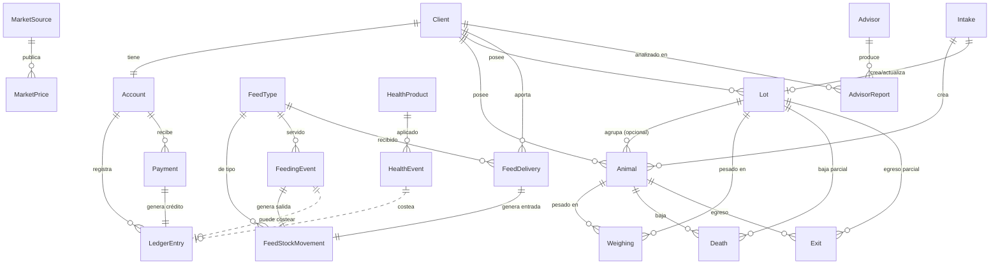

# 02 · Modelo de datos

El corazón del sistema. Todo lo demás (dashboards, asesores, cuenta corriente) se **deriva** de estas entidades. El diseño es *event-sourced*: los hechos operativos son registros inmutables con fecha, y los estados y saldos se calculan a partir de ellos.

## Mapa de aplicaciones (Django apps)

Cada app es un dominio acotado. Las tres primeras son la **columna vertebral compartida** que también servirá a futuros rubros; las demás son el dominio ganadero de hoy.

| App | Responsabilidad | Compartida / Ganadera |
|---|---|---|
| `clients` | Clientes y sus cuentas | Compartida |
| `ledger` | Cuenta corriente: movimientos y pagos | Compartida |
| `market` | Precios de hacienda de referencia | Compartida |
| `advisors` | Asesores con IA e informes | Compartida |
| `livestock` | Animales, lotes, ingresos, pesajes, muertes, salidas | Ganadera |
| `feed` | Catálogo de alimento, stock y raciones | Ganadera |
| `health` | Catálogo sanitario y aplicaciones | Ganadera |

## Diagrama de entidades

## Entidades

Se listan los campos significativos de negocio. Se omiten `id`, timestamps de auditoría (`created_at`, `created_by`) y detalles de framework, que serán estándar en todos los modelos. Todos los modelos operativos son **inmutables** salvo indicación contraria; los catálogos (`FeedType`, `HealthProduct`, `MarketSource`) sí se editan.

### App `clients`

**Client**
- `name` — razón social o nombre.
- `kind` — `boarding` (hotelería) | `own` (hacienda propia del feedlot).
- `tax_id` — CUIT (opcional).
- `contact` — datos de contacto (teléfono, email).
- `is_active` — activo/inactivo.

**Account** (uno a uno con `Client`)
- `client` — FK a `Client`.
- `balance_cached` — saldo denormalizado (ARS) para lectura rápida; se recalcula desde `LedgerEntry`, nunca es la fuente de verdad.
- Convención de signo: **saldo positivo = el cliente debe** (débitos − créditos).

### App `livestock`

**Animal**
- `client` — dueño (FK).
- `lot` — lote al que pertenece (FK, opcional).
- `ear_tag` — caravana (único entre animales activos del cliente).
- `category` — `cow`, `bull`, `steer`, `heifer`, `calf`, …
- `sex` — `male` | `female`.
- `status` — `active` | `dead` | `sold` | `exited`.
- `entry_date`, `entry_weight` — alta.
- `current_weight` — derivado del último `Weighing` (denormalizado).

**Lot**
- `client` — dueño (FK).
- `code` — identificador del lote.
- `mode` — `anonymous` (solo cabezas + kg) | `named` (agrupa `Animal`).
- `head_count` — cabezas actuales.
- `total_weight` — kilos totales actuales.
- `status` — `active` | `closed`.
- Los campos `head_count`/`total_weight` se mantienen por los eventos (`Intake`, `Death`, `Exit`, `Weighing`).

**Intake** (ingreso)
- `client` — FK.
- `date`.
- `mode` — `individual` | `lot`.
- `head_count`, `total_weight` — para modo lote.
- Referencia a los `Animal` o al `Lot` creados.
- **[DECISIÓN]** el ingreso, ¿genera algún cargo (p. ej. derecho de ingreso)? Por defecto **no**; solo alta de hacienda.

**Weighing** (pesaje)
- `target` — apunta a un `Animal` **o** a un `Lot` (exactamente uno; se modela con dos FK nulables + restricción, ver [ADR-26]).
- `date`.
- `weight` — kg del animal, o kg totales del lote.
- El crecimiento (ganancia diaria, GDP/ADG) se calcula entre pesajes consecutivos.

**Death** (muerte / baja)
- `target` — `Animal` o `Lot`.
- `date`, `cause`.
- `head_count`, `weight` — para baja parcial de lote.
- Efecto: `Animal.status = dead`, o resta cabezas/kg al `Lot`.

**Exit** (salida / egreso)
- `target` — `Animal` o `Lot`.
- `date`, `destination`.
- `head_count`, `weight` — para egreso parcial de lote.
- `sale_price` — precio de venta (opcional).
- Efecto: `Animal.status = sold/exited`, o resta cabezas/kg al `Lot`.

### App `feed`

**FeedType** (catálogo, editable)
- `name`, `unit` (por defecto `kg`), `category`, `is_active`.

**FeedDelivery** (aporte del cliente)
- `client` — FK.
- `feed_type` — FK.
- `quantity`, `date`.
- Genera un `FeedStockMovement` de entrada al stock **del cliente**.

**FeedStockMovement**
- `owner_kind` — `own` (feedlot) | `client`.
- `client` — FK (si `owner_kind = client`).
- `feed_type` — FK.
- `direction` — `in` | `out`.
- `quantity`, `date`.
- `source_kind`, `source_id` — evento origen (`feed_delivery`, `feeding_event`, `purchase`, `adjustment`).
- Saldo de stock = Σ entradas − Σ salidas, por (`owner_kind`, `client`, `feed_type`).

**FeedingEvent** (ración diaria)
- `client` — FK.
- `target` — `Lot` o `Animal` (o grupo; ver módulo).
- `feed_type` — FK.
- `quantity` — kg.
- `unit_price` — ARS/kg al momento (histórico).
- `origin` — `client_stock` | `own_stock`.
- `total_cost` — `quantity × unit_price` (derivado).
- Efectos: genera un `FeedStockMovement` de salida; si `origin = own_stock`, genera además un `LedgerEntry` de débito (ver reglas en el módulo 03).

### App `health`

**HealthProduct** (catálogo, editable)
- `name`, `kind` (`vaccine` | `treatment`), `unit_price`, `is_active`.

**HealthEvent** (aplicación)
- `client` — FK.
- `target` — `Animal` o `Lot`.
- `product` — FK a `HealthProduct`.
- `doses` / `quantity`.
- `unit_price` — histórico.
- `total_cost` — derivado.
- Efecto: genera un `LedgerEntry` de débito.

### App `ledger`

**LedgerEntry** (movimiento inmutable)
- `account` — FK.
- `date`.
- `direction` — `debit` (cargo) | `credit` (pago/ajuste a favor).
- `amount` — ARS.
- `concept` — `feeding` | `health` | `service` | `adjustment` | `payment`.
- `source_kind`, `source_id` — referencia genérica al evento que lo originó (`feeding_event`, `health_event`, `payment`, `manual`).
- `unit_price`, `quantity` — snapshot para trazabilidad.
- `description`.
- **Nunca se edita ni se borra.** Una corrección es un nuevo asiento (contra-asiento o `adjustment`).

**Payment**
- `account` — FK.
- `date`, `amount`, `method` (`cash`, `transfer`, …), `reference`.
- Genera un `LedgerEntry` de crédito.

### App `market`

**MarketSource** (catálogo)
- `name` — Cañuelas (MAG), Liniers/SIO, ROSGAN, IPCVA, manual…
- `slug`, `kind` (`market` | `index`), `is_active`.

**MarketPrice**
- `source` — FK.
- `category` — categoría de hacienda.
- `date`.
- `price_per_kg` — ARS/kg.
- `raw` — payload original de la fuente (para auditoría).

### App `advisors`

**Advisor** (catálogo, tres filas)
- `slug` — `livestock` | `finance` | `admin`.
- `name`, `system_prompt` (plantilla base del rol).

**AdvisorReport**
- `advisor` — FK.
- `client` — FK.
- `period_start`, `period_end`.
- `input_snapshot` — métricas que se le pasaron (para reproducibilidad).
- `output` — recomendaciones generadas (texto estructurado).
- `model_id`, `tokens`, `latency` — auditoría de la corrida.

## Notas de modelado

- **Animal vs Lote:** los eventos (`Weighing`, `Death`, `Exit`) pueden apuntar a uno u otro. Se modela con dos claves foráneas nulables (`animal`, `lot`) y una restricción de base que exige exactamente una. Es explícito y consultable; la alternativa (una tabla polimórfica de "unidad de hacienda") se evaluó y se descartó por complejidad. Detalle y fundamento en el **ADR-26**.
- **Costeo genérico:** `LedgerEntry` se referencia a su evento origen con un par (`source_kind`, `source_id`) en lugar de FKs específicas. Esto permite que mañana un evento de otro rubro (una tarea de alfalfa, un service de maquinaria) postee cargos a la cuenta **sin tocar** el modelo del ledger. Es la pieza que hace escalable el costeo. Detalle en el **ADR-25**.
- **Stock como movimientos:** no se guarda un "saldo de stock" editable; se guarda el historial de entradas/salidas y el saldo se deriva. Mismo criterio que la cuenta corriente.
